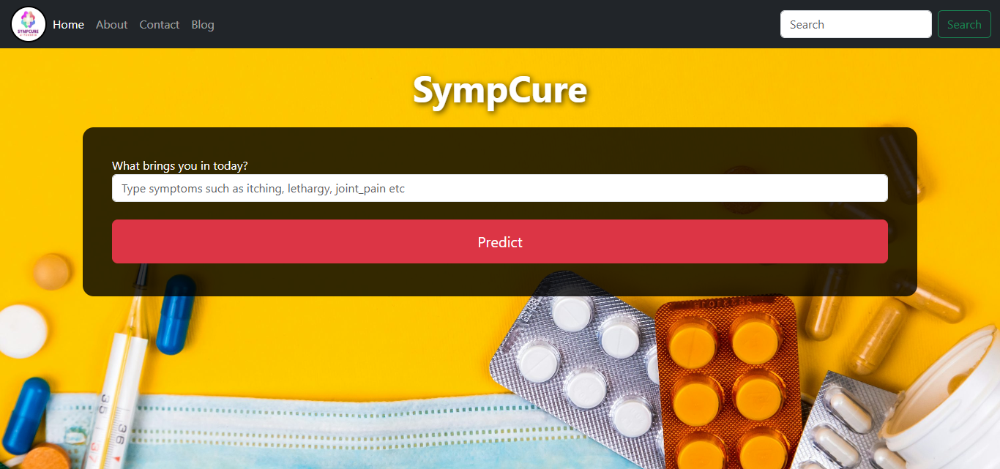
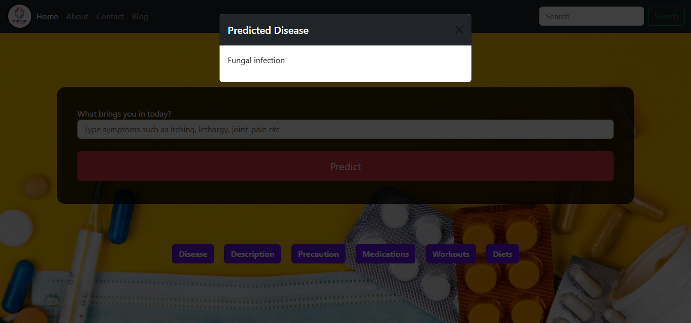

# Symptom-Based Disease Diagnosis & Medicine Recommendation Web App

A machine learning powered web application that predicts possible diseases based on user-selected symptoms. The application provides disease prediction along with precautions, medications, workout suggestions, and diet recommendations through an interactive and user-friendly interface.

---

# 📌 Introduction

SympCure is an AI-driven medicine recommendation system designed to suggest appropriate medicines based on user-entered symptoms. Using machine learning algorithms and a symptom-disease-medicine dataset, the system predicts the most probable disease and provides relevant medication recommendations.

The application also provides additional information such as disease descriptions, precautions, suggested treatments, workout recommendations, and dietary advice.

SympCure allows users to input symptoms through a clean and user-friendly interface. The AI model processes the symptoms and predicts the most likely disease with high efficiency. Based on the prediction, the system recommends suitable medicines and safety precautions.

The system also includes:
- Symptom validation
- Error handling
- Downloadable prediction reports
- Activity logging
- Dataset management and model retraining for administrators
- Symptom suggestion functionality
- Medical disclaimer for safety and reliability

The project demonstrates the practical implementation of Artificial Intelligence, Machine Learning, and Web Development in the healthcare domain.

---

# 🎯 Scope of the Project

The scope of the project covers multiple areas of Artificial Intelligence and software development. It is designed to provide an intelligent and accessible healthcare assistance platform.

## The project scope includes:

- Natural Language Processing (NLP) for interpreting and processing user-entered symptoms.
- Machine Learning models trained on medical datasets that map symptoms to diseases and medicines.
- A user-friendly web interface developed using Flask.
- Structured medical datasets linking symptoms → diseases → medicines.
- Medicine recommendation and disease prediction system.
- Disease descriptions and precaution suggestions.
- Downloadable medical prediction reports.
- Administrative functionality for updating datasets and retraining AI models.
- Error handling and symptom validation mechanisms.
- Activity logging for monitoring and analysis.
- 24/7 accessibility without requiring physical consultation.

The system aims to improve healthcare accessibility by providing quick preliminary guidance based on symptoms entered by users.

---

## 🚀 Live Demo

[Click Here to Visit SympCure](https://sympcure-x01z.onrender.com/)

---

## ✨ Features

- Predict diseases from symptoms
- User-friendly web interface
- Machine Learning prediction model
- Disease details and precautions
- Medication suggestions
- Diet recommendations
- Workout guidance
- Responsive frontend design
- Flask backend integration

---

## 🛠 Technologies Used

### Frontend
- HTML5
- CSS3
- Bootstrap

### Backend
- Python
- Flask

### Machine Learning
- Scikit-learn
- Pandas
- NumPy

### Deployment
- GitHub
- Render

---

## 📷 Screenshots

### Home Page


### Prediction Result


---

# 📂 Project Structure

```bash
SympCure/
│
├── static/               # CSS, images, JavaScript files
├── templates/            # HTML templates for Flask
├── datasets/             # Medical datasets used for training
├── models/               # Trained machine learning models
├── main.py               # Main Flask application
├── requirements.txt      # Project dependencies
└── README.md             # Project documentation
```

---

# 🌐 Deployment

The project is deployed using Render for cloud hosting and GitHub for version control and source code management.

## Deployment Platform
- Render

## Version Control
- GitHub

---

# 🔒 Disclaimer

This system is designed for educational and preliminary guidance purposes only. It should not replace professional medical consultation, diagnosis, or treatment.

Always consult a qualified healthcare professional for serious medical conditions.

---

# ⭐ Future Improvements

- User authentication system
- Doctor consultation integration
- AI chatbot support
- Improved disease prediction accuracy
- Medical history tracking
- Multi-language support
- Voice-based symptom input
- Cloud database integration

---

# 👨‍💻 Author

## Jasdeep Singh

B.Tech Student | AI & Web Development Enthusiast

---

# 📄 License

This project is developed for educational and learning purposes.

---

# 🌟 Support

If you like this project, consider giving it a ⭐ on GitHub.


 
